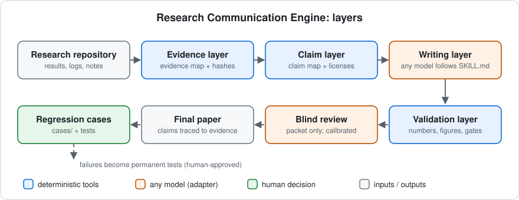
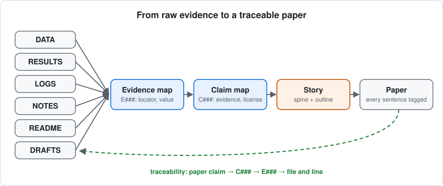
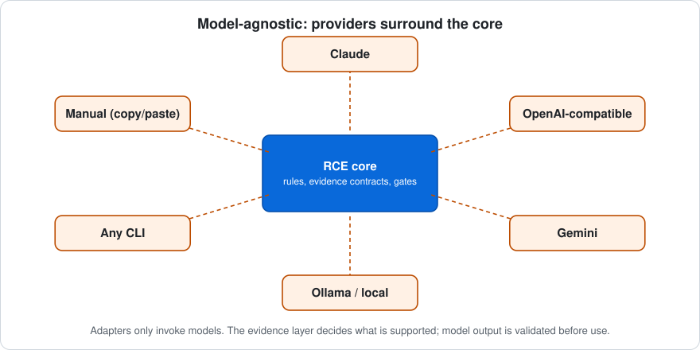
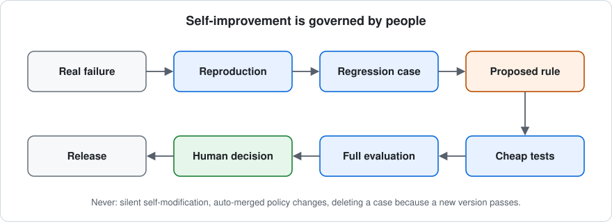

# Research Communication Engine

> Evidence-grounded research writing for AI-assisted research.

Turn raw research evidence into a paper where every claim stays traceable to the evidence that supports it.

[](https://github.com/csdeepak/research_writing_skill/actions/workflows/ci.yml)
[](LICENSE)

RCE turns raw research evidence into traceable, reviewable research papers without allowing unsupported claims to
silently enter the manuscript.

It is a model-agnostic workflow for turning results, logs, notes, READMEs, drafts and data files into
evidence-grounded papers:
1. It builds an **evidence map** before any prose.
2. It traces every claim and every number to that evidence.
3. It validates strong language and citations against explicit rules.
4. It renders figures from source data.
5. It runs a **blind reader/reviewer** pass.
6. It turns real failures into regression tests.

When evidence is missing or conflicting, RCE **asks instead of guessing**.

## Why it exists
Papers written with AI assistance often have individually plausible sentences that add up to something the evidence
does not support: an invented number, a "significant" without a test, a citation from memory, an author's hunch
stated as a finding, a README value that contradicts the results file. RCE makes those failures visible and blocks
them where they can be checked deterministically. The model can propose; the evidence layer decides.

<p align="center"></p>

## Evidence → claim → paper
<p align="center"></p>

Every sentence in a draft carries claim tags (`{C007}`). Each claim cites evidence ids (`E012`), and each evidence item
points to a file (and a line, row or value). The tools check this chain on every run.

## What RCE checks, and what it does not promise
**Checked deterministically** (`docs/concepts/EVIDENCE_INTEGRITY.md` maps each rule to its test):
- **Numbers:** every number in a draft traces to evidence; p-values are never inferred.
- **Strong language:** "significant", "state of the art", "causes", "generalizes", "outperforms"… each needs an evidence
  license (configurable per research community).
- **Citations:** each must resolve to a verified source registry.
- **Conflicts:** conflicting evidence is never silently resolved.
- **Authors' voice:** author-stated limitations and rationale are kept and attributed.
- **Figures:** re-rendered from data to verify, and the axes must match the marks.
- **Gates:** a gate passes only from a tool report, never from an agent saying so.
- **Blind review:** every finding is fixed, declined with a reason, deferred, turned into an author question, or
  marked false-positive / not reproducible. None disappears.

**RCE does not promise:**
- that an underlying model will never hallucinate;
- to replace domain experts, statistical review or peer review;
- to decide whether a hypothesis is true;
- to resolve conflicting evidence by itself: it asks a person;
- to make a claim acceptable because a model sounds confident;
- that papers become easier to understand. Reader-understanding improvement **remains an open evaluation question**
  (see [Current evidence](#current-evidence)).

## Quick start
**Fastest (Claude apps).** Download `research-communication-engine-v0.4.0.zip` from the releases page, or build it
with `python tools/package_skill.py`. Upload it under **Customize → Skills**, which needs code execution enabled. See
[docs/guides/INSTALL.md](docs/guides/INSTALL.md) for Claude Code, ChatGPT (unverified), Codex, Gemini CLI and Cursor.

**Developer.**
```bash
git clone https://github.com/csdeepak/research_writing_skill.git && cd research_writing_skill
python -m unittest discover -s tools/tests          # Python >= 3.9, standard library only
python tools/rce.py check examples/synthetic_project --draft examples/synthetic_project/drafts/flawed.md
```

**Model-independent (any chat model, no API).**
1. Your agent follows `skill/SKILL.md`.
2. The checks run locally: `python tools/rce.py check <project> --draft <draft>`.
3. For the blind review, bind the reviewer to `{"provider": "manual"}`. RCE writes a prompt; you paste it into any
   model and save the reply, which is validated like an API response.

## Example
[`examples/synthetic_project/`](examples/synthetic_project/) is a fully invented study with planted problems. Output of
the command above (abridged):

```text
== artifacts (G1): FAIL (1 error(s), 1 warning(s))
   [ERROR] evidence/E003+E004: same quantity reported as 3 (project/results/metrics.csv) and 4 (project/README.md) but not recorded as a conflict (UNRECONCILED_CONFLICT)
== figures (V1-V6): FAIL (3 error(s))
   ERROR V6 V001   V6_NOT_REPRODUCIBLE   re-rendering from the recorded inputs does not reproduce the file (edited by hand, or inputs changed)
   ERROR V3 V001   V3_AXIS_ENCODING      2 mark(s) disagree with the labelled value axis
== draft lint: FAIL (6 error(s), 4 warning(s), 0 info)
   ERROR   BLOCKED-claim-used             C004 is BLOCKED (unresolved evidence): it cannot appear as a factual claim
   ERROR   UNLICENSED-significance_test   'significantly' asserted for C001 without a significance_test license backed by evidence
   ERROR   UNLICENSED-sota_comparison     'state-of-the-art' asserted for C001 without a sota_comparison license backed by evidence
   ERROR   C5-citation-unregistered       no registered source has this first author and year
   ERROR   C6-injection                   instruction-like text aimed at models/reviewers (INJECTION_DETECTED)
== number tracing: FAIL (1 error(s), 0 warning(s))
   ERROR   UNTRACED_NUMBER  0.69   no evidence value or project-file value matches this number
RESULT: FAIL (see ERROR lines; each names the rule to satisfy)
```

The clean control passes. Two planted problems are **not** caught (a missing sample size, and the direction of a
percentage's denominator), and the example says so.

## Model-agnostic
<p align="center"></p>

- **Rules and checks:** the rules are plain text and the checks are standard-library Python.
- **Roles on any model:** the blind reviewer, grader and readers run on any model bound in `.rcs/models.json`:
  OpenAI-compatible APIs (OpenAI, OpenRouter, Ollama, vLLM, LM Studio, Groq), Anthropic, Gemini, any CLI, or manual
  copy-paste.
- **Local-first:** the defaults point at a local server, hosted endpoints must be explicitly allowed, and keys come
  only from environment variables ([docs/PRIVACY.md](docs/PRIVACY.md)).

## Current evidence
Every row has a source ([docs/research/EVALUATION.md](docs/research/EVALUATION.md)).

| Area | Status |
|---|---|
| Evidence/claim traceability | Implemented (schemas + validator) |
| Deterministic validation | Implemented; **104 automated tests passing** (`python -m unittest discover -s tools/tests`) |
| Replay of known failures | 49 fixtures: 29 adversarial, 16 negative controls, 4 from real failures (`tools/replay_fixtures.py`) |
| Documented real failure cases | 18 (`cases/failures/`), each linked to its regression test |
| Blind review | Demonstrated in an end-to-end run with author answers and two review rounds (private project; process results only) |
| Multi-model reviewer calibration | Claude Opus 0.933, NVIDIA Nemotron 0.945, Qwen3.8-27B 0.911 sensitivity (bar ≥ 0.90), 7-paper benchmark, 1 seed |
| Reader-comprehension improvement | **Not established.** v0.1.0 vs a plain agent: better on 2 of 6 projects. v0.3.0 vs v0.1.0: better on 1 of 3, worse on none; single runs, noise up to 0.19 |
| Human reader study | Not run (protocol and kit ready) |
| Validity across research domains | Not established (ML/IR/speech/vision/agents papers only) |

## Known limitations
- The tools check consistency, traceability and licensed wording. They cannot check whether a model *understood* a
  source correctly, or overreach phrased without trigger words. Those are left to the blind reviewer and to people.
- Known deterministic gaps: missing sample sizes, the direction of a percentage change's denominator, and units in
  prose.
- The evaluation is small: 6 public projects, 1 private project, single runs, LLM readers.
- The Claude app and ChatGPT installation paths depend on product features that change. Re-check
  [INSTALL.md](docs/guides/INSTALL.md).

## Self-improvement, governed by people
<p align="center"></p>

Failures become permanent cases and tests. Rule changes are proposals, evaluated by pre-registered tests and **decided
by a maintainer**. RCE never rewrites its own standards
([docs/concepts/SELF_IMPROVEMENT.md](docs/concepts/SELF_IMPROVEMENT.md)).

## Documentation
- [Architecture](docs/architecture.md)
- [Evidence integrity](docs/concepts/EVIDENCE_INTEGRITY.md)
- [Evaluation](docs/research/EVALUATION.md)
- [Install](docs/guides/INSTALL.md)
- [Privacy](docs/PRIVACY.md)
- [Security](SECURITY.md)
- [Migration assessment](docs/OPEN_SOURCE_MIGRATION_ASSESSMENT.md)
- Design history: `docs/01`–`06` and `evaluation/`

## Contributing
The most useful contribution is a failure report: an unsupported claim that got through, or a correct one that was
blocked. See [CONTRIBUTING.md](CONTRIBUTING.md), [GOVERNANCE.md](GOVERNANCE.md), [CODE_OF_CONDUCT.md](CODE_OF_CONDUCT.md)
and [SUPPORT.md](SUPPORT.md). Roadmap: [ROADMAP.md](ROADMAP.md).

## Citation
See [CITATION.cff](CITATION.cff) (C S Deepak, *Research Communication Engine*, v0.4.0). There is no paper or DOI yet.

## License
[Apache License 2.0](LICENSE). Third-party texts used in the evaluation are not redistributed; see [NOTICE](NOTICE).
The theoretical foundation draws on course material summarised and cited in `docs/01_FOUNDATION_ANALYSIS.md`.
