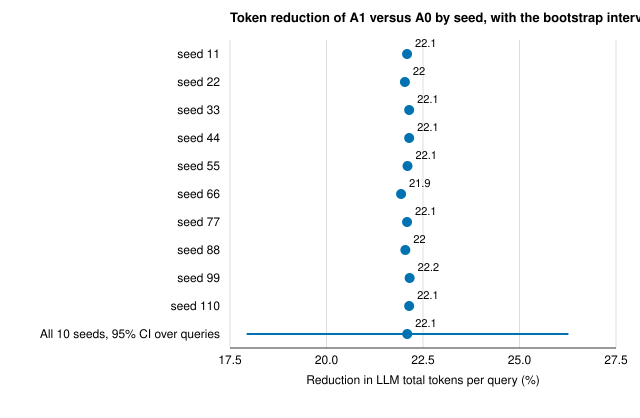
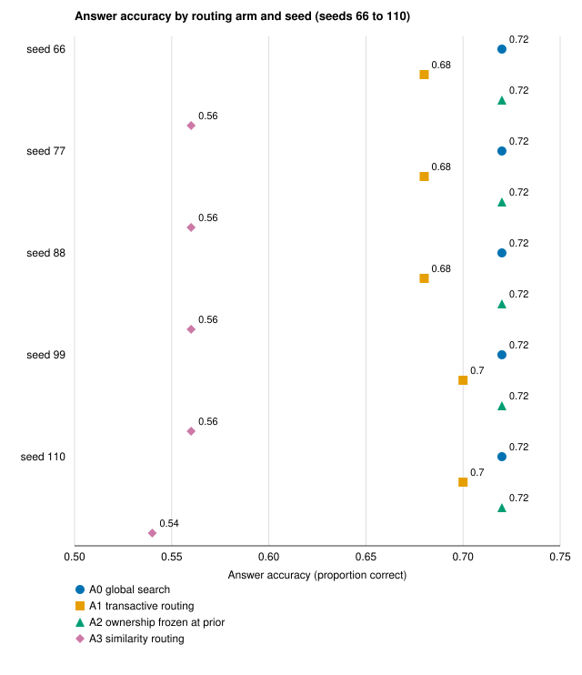
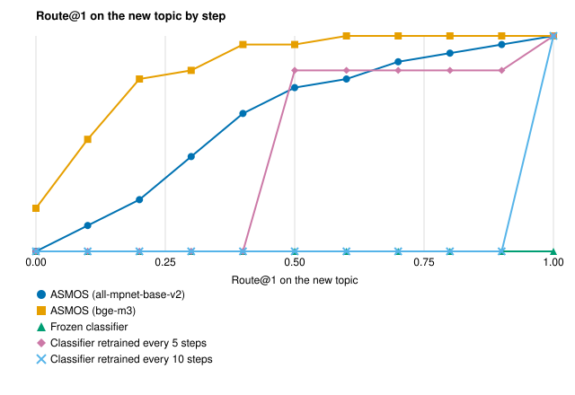

# Learning Which Agent to Ask: A Token-Cost and Adaptation Study of Ownership-Based Routing in Shared LLM-Agent Memory

## Abstract

Teams of large language model (LLM) agents that share a memory must decide which agent to ask, and asking all of them (global search) costs tokens on every query {C032}. We study the Adaptive Semantic Memory Operating System (ASMOS), which learns from verified outcomes which agent owns each topic and routes a query to that owner {C032}. On a deliberately constructed 50-query corpus, with gpt-4o-mini and 10 seeds, routing to the learned owner used 22.1% fewer LLM total tokens per query than global search (bootstrap 95% confidence interval (CI) 17.9% to 26.3%) {C001}. Accuracy was lower under routing: in the five recorded seeds, routing answered 0.68 to 0.70 of questions correctly against 0.72 for global search, below it in every seed, while answerability was equal at 0.98 {C007, C006}. With ownership frozen at its initial value the saving nearly disappeared, which is consistent with ownership evolution producing it in this corpus {C005}. When a new topic appeared, ASMOS reached a cumulative regret (the summed shortfall in route@1, the share of queries sent first to the right owner) of 3.24 (std 1.30) with one embedder and 0.92 (std 0.41) with another, with 0 retrains, against 4.8 to 10.0 for classifier baselines over 5 seeds {C009, C010}. On static single-agent question answering, ASMOS-memory scored below both a no-memory baseline and retrieval-augmented generation, so ASMOS is a routing and cost tool, not an accuracy method {C015}. The corpus is deliberately constructed, so the saving is not a rate for organic multi-agent workloads {L004}.

## 1. Introduction

A team of LLM agents that share a semantic memory has to answer a routing question for every query: whose memory should be consulted? The default is global search, which consults every candidate. In the test corpus used below, global search considers a mean candidate-set size of 32.0 and passes 123.2 context tokens per query to the answering model {C033}. ASMOS is a shared semantic-memory layer for teams of LLM agents plus an ownership layer that decides which agent to ask {C032}. Ownership of a topic is learned online from verification-gated reputation: a verified claim raises an agent's ownership of a topic, a refuted claim lowers it, and a query is routed to the learned owner with a confidence-gated fallback to global search {C032}. The authors give a reason for foregrounding cost and answerability rather than answer accuracy as the primary measures. Whether that reason holds on this corpus is an open question to the authors, so we do not adopt it and report accuracy as measured in Section 4.2 {C031}.

The gap we address is one of measurement: what learned ownership saves relative to global search, what it costs in answer quality, and how it behaves when the set of topics changes. No verified literature is available to us, so we cannot place the work against published routing or memory methods [CITATION NEEDED: prior work on routing queries among agents and on multi-agent memory]. We therefore ask four research questions and check one boundary. RQ1: how many fewer LLM tokens per query does routing to a learned owner use than global search, and how certain is the size? RQ2: what does routing do to answer accuracy and to answerability? RQ3: is the saving tied to ownership evolving from verified outcomes? RQ4: how does ownership-based routing behave when a new topic appears, compared with supervised classifier routers? The boundary check asks whether ASMOS memory helps on a static single-agent question-answering task.

We use three experiments on stored result files, and the paper makes five contributions, each tied to a result:

1. A measured token saving: routing to the learned owner used 22.1% fewer LLM total tokens per query than global search, with a bootstrap interval, a signed-rank test and an effect size reported beside the number of non-zero pairs (Section 4.1) {C001, C002}.
2. An accuracy accounting: accuracy under routing was below global search in every measured seed while answerability was equal (Section 4.2) {C007, C006}.
3. An ablation consistent with ownership evolution providing the saving, within this corpus (Section 4.3) {C005}.
4. New-topic adaptation with two embedders, and a negative result for a degraded embedder (Section 4.4) {C009, C010, C012}.
5. Scope-setting results: ASMOS-memory does not help on static question answering, and the stored effect size was corrected (Sections 4.5 and 4.6) {C015, C030}.

Section 2 gives context, Section 3 the setup, Section 4 the results by question, and Sections 5 to 7 the discussion, limitations and conclusion.

## 2. Context and related work

We organize the context by the dimension along which alternatives differ, and we claim no novelty: no literature search was run for this draft. On how a query is routed, this study compares global search, similarity routing, routing with ownership frozen, and routing by ownership learned from verified outcomes {C032}. On how a memory answers, a retrieval-augmented generation (RAG) baseline and a no-memory baseline bracket ASMOS memory in the static comparison [CITATION NEEDED: retrieval-augmented generation and memory-augmented language-model baselines]. On what adapts under change, the comparison is a supervised classifier router, frozen or retrained on a schedule, which regains a new topic only after a retrain {C009}. How work on expert finding or on reputation from verified outcomes relates to learned ownership is left open [CITATION NEEDED: expert finding and reputation from verified outcomes].

## 3. Method and experimental setup

### 3.1 The system and the four routing arms

ASMOS keeps checkpoints in a shared store under a frozen memory contract (version 1.2) with a six-stage lifecycle from new to forgotten {C038}. The routing layer scores an agent for a query by the product of the query's similarity to the agent's memory and the agent's ownership of the topic, and falls back to global search when that score is below a threshold (tau) {C032}. We compare four arms. Global search (A0) consults every candidate. Transactive routing (A1), the project's name for routing on ownership that evolves with verified outcomes, is ASMOS as described above.

Ownership frozen at its initial prior (A2) is the single-variable ablation of A1: the router falls back to global search {C005}. Similarity routing without ownership (A3) routes on embedding similarity alone {C004}.

### 3.2 The cost experiment

The evaluation set has 50 queries in five query classes on a corpus with two agents whose ownership is asymmetric by construction {C033}. The authors state that ownership asymmetry does not emerge organically because the corpus is deliberately constructed {L004}. A separability check on topic centroids returned go (mean within-domain cosine similarity 0.2666, mean cross-domain 0.1024, maximum cross-domain 0.2072) {C034}. The answering model is gpt-4o-mini at temperature 0, run with 10 seeds (11, 22, 33, 44, 55, 66, 77, 88, 99, 110) and a frozen routing threshold of 0.351493 {C001}. The first five seeds come from an earlier result file that is not in the material available to us; per-seed accuracy, answerability, route@1 and context tokens exist for seeds 66 to 110 only {C006}.

The primary measure is LLM total tokens per query. The authors state that these counts are exact usage figures returned by the answering model's interface and do not depend on the embedder, while the embedder of their earliest centerpiece run is unconfirmed {L008}. We also report answer accuracy, whose grading procedure is not documented {C007}; answerability, the project's per-query measure of whether the routed context supports an answer [ASK AUTHOR: operational definition of answerability]; and route@1, the fraction of queries whose top routed agent is the ground-truth owner, which is 0.0 for global search by construction because it routes to no single agent {C008}.

### 3.3 Statistical design and the authors' reasons for it

The uncertainty is a bootstrap 95% confidence interval over the 50 queries with 2000 resamples {C001}. The paired per-query difference is tested with a one-sided Wilcoxon signed-rank test, normal approximation, dropping zero differences {C002}. The authors keep zero differences dropped (the wilcox method) because switching to the Pratt method would change an already pre-registered p-value {C026}. No multiplicity correction is applied, because the analysis is a single comparison of A0 with A1 {C028}. The effect size is the matched-pairs rank-biserial correlation [CITATION NEEDED: Kerby 2014, named in the project's correction record]. The authors chose it because it is the direct companion of the signed-rank test that was run and has a single definition; they do not report Rosenthal's z divided by the square root of N because its N can be read three ways (0.803, 0.819 or 0.568 on the headline) {C025}. They report the number of non-zero pairs (n_eff) beside every effect size, because a bare r = 1.0 invites the false reading that every query improved {C027}.

### 3.4 The adaptation experiments

In the new-topic regime a new topic appears whose true owner is a single agent, and the router has to find that owner; the run has 10 steps, 5 evaluation queries per step and 5 seeds (0 to 4), with two embedders, all-mpnet-base-v2 and bge-m3 {C009, C010}. ASMOS uses the routing threshold 0.351493, and the classifier baselines use a threshold of 0.5 and are either frozen, retrained every 5 steps, or retrained every 10 steps {C009}. Regret is the sum over steps 1 to 10 of one minus route@1 on the new topic, so a router that does not find the topic at any step has a regret of 10.0 {C009}. The authors exclude one embedder cell (bge-small in the new-topic replication) because its run fell back to a hash embedder and produced a degenerate regret {L009}. A separate single run compares the MiniLM-L6-v2 embedder with a lexical-hash fallback, which the authors regard as a degraded offline mode and not the evaluation baseline, so routing results use MiniLM {C029}.

### 3.5 The static question-answering comparison

The four systems are No-Memory, RAG, ASMOS-memory alone and ASMOS combined with RAG, each run once on 24 question-answering items from RULER, which the project uses as its static single-agent question-answering set, with one uniform answering call and gpt-4o-mini {C013}. There are no seeds. Retrieval precision and recall and route@1 cannot be computed here because the data has no relevant-document labels and no owner labels, and the combined system exercises routing with a single expert {L002}.

## 4. Results

### 4.1 RQ1: routing to a learned owner cut tokens per query by 22.1%

Table 1 gives the four arms side by side; this subsection uses its first two columns. Over 50 queries and 10 seeds, the mean LLM tokens per query were 180.2 for global search (A0) and 140.4 for transactive routing (A1), so A1 used 22.1% fewer tokens, a mean of 39.8 tokens per query {C004, C001}. The mean context tokens per query fell from 123.2 to 83.6 and the mean candidate-set size from 32.0 to 20.8 {C033}.

**Table 1.** Global search (A0) and ownership frozen at its prior (A2) cost about the same, transactive routing (A1) costs fewer tokens per query with equal answerability but lower accuracy, and similarity routing (A3) is cheapest but answers far fewer queries. Tokens per query are means over 50 queries and 10 seeds; other columns cover seeds 66 to 110 (accuracy is a range). {C001, C004, C006, C007, C008, C033}

| Arm | LLM tokens per query | Context tokens | Candidate-set size | Answer accuracy | Answerability | route@1 |
|---|---|---|---|---|---|---|
| A0 global search | 180.2 | 123.2 | 32.0 | 0.72 | 0.98 | 0.0 |
| A1 transactive routing | 140.4 | 83.6 | 20.8 | 0.68 to 0.70 | 0.98 | 0.909 |
| A2 ownership frozen at prior | 179.3 | 122.3 | 31.7 | 0.72 | 0.98 | 0.0 |
| A3 similarity routing | 123.4 | 65.9 | 17.9 | 0.54 to 0.56 | 0.58 | 0.614 |

Figure 1 shows how certain the size is. The bootstrap 95% CI over queries is 17.9% to 26.3%, and the per-seed reductions lie between 21.9% and 22.2% {C001}. The one-sided Wilcoxon signed-rank test on the 50 per-query differences gave W = 1141.5 and p = 6.788e-09, over 48 non-zero pairs of 50; the rank-biserial correlation is r = 0.941 (T+ = 1141.5, T- = 34.5). Of the 50 pairs, 43 favoured routing, 5 favoured global search and 2 were identical {C002}. The interval is wide relative to the per-seed spread because it reflects the differences between queries: the per-seed standard deviation of the reduction is 0.07 percentage points against an interval width of 8.3, so more seeds would not narrow the interval {C003}. Extending from 5 seeds to 10 moved the headline from 22.109% to 22.0911% {C035}.

**Figure 1.** Per-seed token reductions are nearly identical (21.9% to 22.2%), while the bootstrap 95% confidence interval over the 50 queries spans 17.9% to 26.3%, so the uncertainty comes from the queries, not the seeds. Points are the reduction in LLM total tokens per query of A1 relative to A0 in each of 10 seeds; the last row pools all 10 seeds. The horizontal axis does not start at zero. Source: the project's 10-seed cost result file. {C001, C003}

This answers RQ1: on this constructed corpus and answering model, learned-ownership routing used about a fifth fewer LLM tokens per query than global search {C001}. It does not show the saving on an organic workload, for other answering models, or for accuracy, which the next subsection examines. Corrected signed-rank statistics are also recorded for three further cost runs: gpt-4o-mini with 5 seeds (W = 1142.5, 48 of 50 non-zero, r = 0.943), qwen3-30b-a3b with 5 seeds (W = 1052.0, 46 of 50, r = 0.946) and a one-seed qwen-2.5-72b pilot (W = 666.0, 36 of 50, r = 1.0, with 14 zero differences, so not every query improved) {C036, C027}. Their percentage reductions are not recorded in the material available to us, so they do not establish the size of the saving for another model {C036}.

### 4.2 RQ2: routing kept answerability but lowered accuracy in every measured seed

In the five newest seeds (66, 77, 88, 99, 110), answerability was 0.98 for A0, A1 and A2 and 0.58 for the similarity arm A3 in every seed {C006}. Answer accuracy was 0.72 for A0 and A2 in every seed, between 0.68 and 0.70 for A1 and between 0.54 and 0.56 for A3 {C007}. Figure 2 shows that A1 is below A0 in every one of the five seeds. No paired test of the accuracy difference is available and the grading procedure is not documented, so the size of the accuracy cost cannot be bounded {C007, L012}.

**Figure 2.** Transactive routing (A1) answered 0.68 to 0.70 of questions correctly in each of five seeds, below global search (A0) at 0.72 in every seed, while ownership frozen at its prior (A2) matched A0 and similarity routing (A3) reached 0.54 to 0.56. Each point is one arm in one seed over 50 queries (seeds 66 to 110); no paired test is available. The horizontal axis does not start at zero. Source: the project's 10-seed cost result file. {C007}

This answers RQ2: routing preserved answerability relative to global search (0.98 for both) but not accuracy, so the token saving in Section 4.1 comes with lower accuracy in these seeds {C006, C007}. The similarity-only arm shows the trade-off in the other direction: it is the cheapest arm at 123.4 tokens per query but its answerability is 0.58, far below the 0.98 of A0 and A1 {C004, C006}. The route@1 of A1 was 0.909 against 0.614 for A3, so learned ownership sent more queries to the correct owner than similarity alone {C008}.

### 4.3 RQ3: freezing ownership removed almost all of the saving

With ownership frozen at its prior (A2), the mean LLM tokens per query were 179.3, within 0.9 tokens of global search (180.2) and 38.9 tokens above A1 (140.4) {C004}. The router under A2 falls back to global search, with route@1 of 0.0 {C005, C008}. This is consistent with ownership evolution being what produces the saving in this corpus, since the only difference between A1 and A2 is whether ownership updates {C005}. It answers RQ3 at low confidence, because the comparison is a single ablation with pooled means, without a test, per-seed gap or interval for A1 against A2, and the result concerns a constructed corpus {C005, L013}.

### 4.4 RQ4: ASMOS adapted to a new topic without retraining

With the all-mpnet-base-v2 embedder, ASMOS reached a cumulative regret of 3.24 (std 1.30) with 0 retrains and routed the new topic in 5 of 5 seeds. A frozen classifier did not route it in any of the 5 seeds (regret 10.0), a classifier retrained every 5 steps had regret 4.8 (std 0.4, 2 retrains) and one retrained every 10 steps had regret 9.0 (1 retrain); ASMOS therefore had the lowest regret in this run {C009}. With the bge-m3 embedder, ASMOS reached 0.92 (std 0.41) with 0 retrains and again routed the topic in 5 of 5 seeds, and the classifier baselines were identical (10.0, 4.8 and 9.0) {C010}. Figure 3 shows the route@1 path: ASMOS climbs gradually, and after its first retrain at step 5 the classifier retrained every 5 steps is briefly ahead of ASMOS with the all-mpnet-base-v2 embedder, before ASMOS passes it {C009}. No significance test is recorded for these regret comparisons {C009, C010}.

**Figure 3.** Without any retraining, the share of new-topic queries that ASMOS sends first to the right owner rises gradually over the steps, whereas a frozen classifier stays at zero and the retrained classifiers stay at zero until their first retrain. Route@1 for ASMOS starts at 0.0 (all-mpnet-base-v2) or 0.2 (bge-m3) at step 0; lines are means over 5 seeds; classifier lines are from the all-mpnet-base-v2 run and are the same in the bge-m3 run. No error bars are drawn; the source records the standard deviation across seeds. Source: the project's new-topic result file. {C009, C010}

Three qualifications apply. Regret depends strongly on the embedder, 3.24 against 0.92 {C009, C010}. The artifacts record 10 labels consumed by ASMOS, as by the retraining classifiers, and that counter is not documented, so we draw no conclusion about labelling cost {C009}. Per-step answerability is identical for all four arms in both runs (0.0 at step 0 rising to 1.0 at step 10), so the comparison rests on routing precision alone {C011}. In a separate single stationary run with no seeds, ASMOS with the MiniLM-L6-v2 embedder matched the classifier on route@1 (1.0 versus 1.0) with higher answerability (0.909 versus 0.727), but with the lexical-hash fallback embedder its route@1 was 0.667 versus 1.0 for the classifier, so it was not routing-competitive there {C012}.

This answers RQ4 for the tested regime and embedders: ASMOS found a new topic with no retraining and lower regret than scheduled classifiers, and the result does not extend to the degraded embedder {C009, C010, C012}.

### 4.5 Boundary: ASMOS-memory does not help on static question answering

Table 2 gives the four-system comparison on 24 items. Exact-match scores were 0.3333 for No-Memory, 0.7083 for RAG, 0.1667 for ASMOS-memory and 0.625 for ASMOS combined with RAG, equal to the containment scores in every row {C013}. Token-F1 was 0.5642, 0.7513, 0.4155 and 0.4329 {C013}. ASMOS-memory alone scored below No-Memory and below RAG, and ASMOS did not exceed RAG {C015}. The paired token-F1 difference of RAG over ASMOS-memory was 0.3358 (bootstrap 95% CI 0.1494 to 0.5228), and ASMOS combined with RAG was below RAG by 0.3184 (CI -0.4990 to -0.1406); combined minus ASMOS-memory was +0.0174 (CI -0.1546 to +0.1862), which spans zero {C014}. No p-values are recorded for these comparisons, so we rely on the intervals alone {C014, L016}.

**Table 2.** In a single run of static question answering, ASMOS-memory scores below both No-Memory and RAG, and combining ASMOS with RAG does not recover RAG's token-F1. All rows are one run of 24 items; mean total tokens are per question. {C013, C015, C037}

| System | Exact match | Token-F1 | Mean total tokens |
|---|---|---|---|
| No-Memory | 0.3333 | 0.5642 | 152.0 |
| RAG | 0.7083 | 0.7513 | 711.4 |
| ASMOS-memory | 0.1667 | 0.4155 | 353.7 |
| ASMOS + RAG | 0.625 | 0.4329 | 1181.9 |

ASMOS-memory used 353.7 total tokens per question against 711.4 for RAG but scored lower, and the combined system spent the most, 1181.9 {C037}. The authors state that ASMOS does not beat RAG on span-retrieval question answering and is not a question-answering-accuracy method {L003}. The cost result therefore concerns routing among owners, not memory quality on static questions.

### 4.6 A correction to the reported statistics

The effect size first stored for the headline test (r = 0.688, labelled a rank-biserial correlation) and its z-statistic (4.865) were computed incorrectly, and are superseded by r = 0.941 and z = 5.679 {C030}. The authors' correction record reports that the stored value used null moments built on all 50 pairs while the statistic ranks 48, so the defect could only understate a positive effect {C030}. W, the one-sided p-value, the percentage reduction, the interval and the per-seed spread did not change {C030}.

## 5. Discussion

RQ1: routing to a learned owner used 22.1% fewer LLM tokens per query on the constructed corpus {C001}. RQ2: answerability was equal, but accuracy was below global search in each of five seeds {C006, C007}. RQ3: the ablation is consistent with ownership evolution providing the saving {C005}. RQ4: with two embedders ASMOS adapted to a new topic without retraining, at lower regret than scheduled classifiers {C009, C010}.

Costs and benefits should be read together. Learned ownership sits between global search and similarity routing: it cost 39.8 tokens per query less than global search while keeping answerability at 0.98, whereas similarity routing cost fewer tokens still (123.4 against 140.4 for A1) but its answerability was 0.58 {C004, C006}. A possible, untested explanation is that the ownership signal, and not the similarity score, is what lets routing narrow the candidate set without losing coverage on this corpus, although the accuracy shortfall of A1 suggests that narrowing the set is not free {C005, C007}.

We cannot relate these results to published methods [CITATION NEEDED: comparison with prior routing and memory work]. Within the limitations below, where a workload has topic-specific owners and a small accuracy cost is acceptable, learned ownership is a candidate way to lower per-query token cost, and it adapted without retraining in the tested regime {C001, C009}. It is not evidence for using ASMOS to improve answer quality on static questions {C015}.

## 6. Limitations

### 6.1 Limitations stated by the authors

The authors state that more seeds cannot narrow a confidence interval that is set by heterogeneity between queries, so the interval over queries, not the per-seed spread, is the uncertainty on the size of the saving {L001}. They state that ownership asymmetry does not emerge organically because the corpus is deliberately constructed, so the saving must not be read as a rate for organic multi-agent workloads {L004}. They state that ASMOS does not beat RAG on span-retrieval question answering and is not a question-answering-accuracy method, so nothing here supports an accuracy advantage over RAG {L003}. They note that retrieval precision and recall and route@1 cannot be computed on the single-agent question-answering data, which has no relevant-document or owner labels {L002}.

They list among their own caveats a convergence and sample-efficiency hypothesis that was tested; its result is not reported here because the result file is not in the material available to us and its reporting is undecided, so we claim nothing about faster or more sample-efficient learning of ownership {L005}. They list as descoped agent-specific memory projection, contradiction detection (refutation is claimed only when supplied as a verification outcome) and continuous forgetting (off by default) {L006}. They state that the routing threshold is tuned in the same corpus rather than on a held-out split (which can favour ASMOS), that question-answering grading is done by an LLM, and that a memory-reuse threshold is an untuned placeholder feeding none of the reported numbers; they also list a multi-agent validation caveat whose result is withheld here {L007}. They state that the embedder of their earliest centerpiece run is unconfirmed {L008}. They exclude one embedder cell from the new-topic replication because its run fell back to a hash embedder {L009}. They note that a recorded continuous-integration pass or coverage artifact is an outstanding item, so we report no software test result {L010}.

### 6.2 Additional caveats

Additional caveats are ours, not the authors' concessions. Seeds 11 to 55 are pooled from a result file that is absent, and the other per-seed measures exist for seeds 66 to 110 only {L011}. Accuracy grading is not documented and no paired test exists, while A1 is below A0 in every measured seed, so the token saving comes with lower accuracy in every measured seed {L012}. No test, per-seed gap or interval exists for A1 against A2, so the attribution to ownership evolution is stated as consistent with, not established {L013}. The corpus, query set, agent partition and code are not in the material available to us, and classifier tuning is not documented, so regret comparisons cannot be checked for budget parity {L014}. The new-topic regime has 5 seeds and 5 evaluation queries per step, and regret differs about threefold between embedders {L015}. The four-system comparison is one run of 24 items with no p-values {L016}. The stationary embedder run is a single run with no stated query count {L017}. For other answering models only signed-rank statistics are recorded {L018}. Several results in the project's documentation are not reported because their source files are missing, so this paper is narrower than the project's own summary {L019}. The headline saving uses one answering model, gpt-4o-mini {L020}.

## 7. Conclusion

On a deliberately constructed corpus, routing to an agent chosen by ownership learned from verified outcomes used 22.1% fewer LLM tokens per query than global search, at a small accuracy cost in every measured seed {C001, C007}. The ablation is consistent with ownership evolution providing the saving, and ASMOS adapted to a new topic without retraining in the tested regime {C005, C009}. The key boundary is that the corpus is constructed and ASMOS-memory does not improve static question answering {L004, C015}. Next questions are whether the saving survives an organic workload and other answering models, and what a paired accuracy test shows.

## Availability and disclosure

The corpus, query set and code were not part of the material used for this paper [ASK AUTHOR: data and code availability statement]. This draft was prepared with an automated writing assistant [ASK AUTHOR: AI-use disclosure wording for the venue].

## References

No verified references are available for this draft; see the citation markers in the text.
