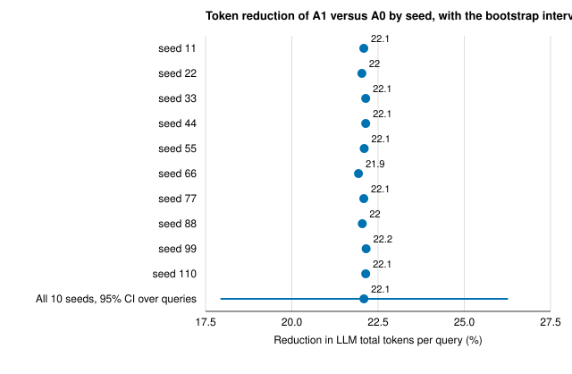
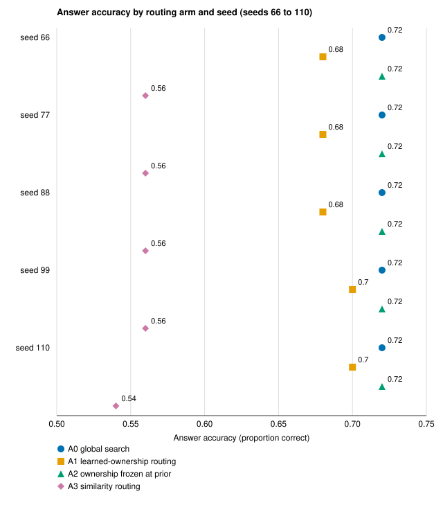
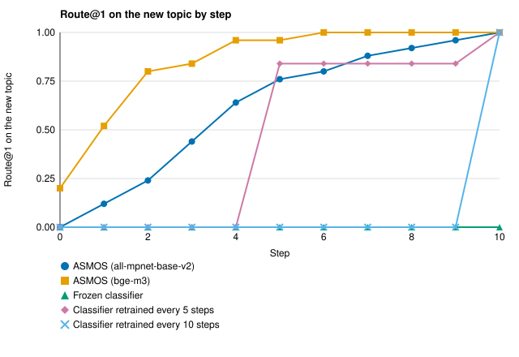

# Learning Which Agent to Ask: A Small-Scale Study of Token Cost and Adaptation in Ownership-Based Routing for Shared LLM-Agent Memory

## Abstract

When several large language model (LLM) agents share a memory, a system must decide which agent's memory to consult for each query; consulting all of them (global search) costs tokens on every query {C032}. We measure the Adaptive Semantic Memory Operating System (ASMOS), which learns from verified outcomes which agent owns each topic and routes queries to that owner {C032}, on a deliberately constructed corpus with two agents {C033}. On 50 queries with gpt-4o-mini and 10 seeds, routing used 22.1% fewer LLM total tokens per query than global search (bootstrap 95% confidence interval (CI) 17.9% to 26.3%) {C001}. Answerability (a per-query measure whose definition is undocumented) was 0.98 under both, but accuracy was lower under routing in each of five recorded seeds (0.68 to 0.70 against 0.72; no paired test), so the accuracy cost cannot be bounded {C006, C007}. With ownership frozen at its initial value the router did not route and the saving nearly disappeared, which is consistent with the saving requiring routing but does not isolate learning {C005}. For a new topic, ASMOS reached a cumulative regret (summed shortfall in route@1, the share of queries sent first to the right owner) of 3.24 (std 1.30) and 0.92 (std 0.41) with two embedders and 0 retrains, against 4.8 to 10.0 for scheduled classifier routers over 5 seeds, untested {C009, C010}. On static question answering, ASMOS-memory scored below a no-memory baseline and retrieval-augmented generation, so ASMOS is a routing and cost tool {C015}. The saving is not a rate for organic workloads {L004}.

## 1. Introduction

When LLM agents share a semantic memory, every query raises a routing question: whose memory should be consulted? The default is global search, which consults every candidate. On the test corpus used below, which has two agents, global search considers a mean of 32.0 candidates and passes 123.2 context tokens per query to the answering model, so candidates are not agents {C033}. ASMOS adds to a shared memory an ownership layer that decides which agent to ask. Ownership of a topic is learned online from verification-gated reputation: a verified claim raises an agent's ownership of a topic, a refuted claim lowers it, and a query is routed to the learned owner, with a fallback to global search when routing is not confident {C032}.

The gap we address is one of measurement: what learned ownership saves relative to global search, what it costs in answer quality, and how it behaves when the set of topics changes. No verified literature was available for this paper, so we cannot place the work against published routing or memory methods [CITATION NEEDED: prior work on routing queries among agents and on multi-agent memory]. We ask four research questions and check one boundary. RQ1: how many fewer LLM tokens per query does routing to a learned owner use than global search, and how certain is the size? RQ2: what does routing do to answer accuracy and answerability? RQ3: does the saving depend on ownership having moved from its prior, as tested by freezing it? RQ4: when a new topic appears, how quickly does ownership-based routing reach its owner, measured by cumulative regret in route@1, compared with supervised classifier routers? The boundary check asks whether ASMOS memory helps on static single-agent question answering.

The paper is a bounded measurement, not a new method positioned against prior work. It makes four contributions, each tied to a result:

1. A token saving of 22.1% per query against global search, with a bootstrap interval, a signed-rank test and an effect size beside the number of non-zero pairs (Section 4.1) {C001, C002}.
2. An accuracy accounting: equal answerability, but lower accuracy in every recorded seed by an amount the evidence cannot bound (Section 4.2) {C007, C006}.
3. An ablation, with its reach stated, that is consistent with the saving requiring routing on learned ownership (Section 4.3) {C005}.
4. Descriptive new-topic results with two embedders and two negative results: a degraded embedder, and static question answering (Sections 4.4 and 4.5) {C009, C010, C012, C015}.

Section 2 gives context, Section 3 the setup, Section 4 the results by question, and Sections 5 to 7 the discussion, limitations and conclusion.

## 2. Context and related work

We organize the context by dimension and claim no novelty, since no literature search was run. On how a query is routed, this study compares global search, similarity routing, routing with ownership frozen, and routing on ownership learned from verified outcomes {C032}. On how a memory answers, a retrieval-augmented generation (RAG) baseline and a no-memory baseline bracket ASMOS memory in the static comparison [CITATION NEEDED: retrieval-augmented generation and memory-augmented language-model baselines]. On what adapts under change, the comparison is a supervised classifier router, frozen or retrained on a schedule, which regains a new topic only after a retrain {C009}. How work on expert finding or on reputation from verified outcomes relates to learned ownership is left open [CITATION NEEDED: expert finding and reputation from verified outcomes].

## 3. Method and experimental setup

### 3.1 The system and the four routing arms

For each query, the ASMOS router scores an agent by the product of the query's similarity to the agent's memory and the agent's ownership of the topic, routes to the top-scoring agent, and falls back to global search when the score is below a threshold (tau) {C032}. The authors state that the ownership verification is deterministic and not judged by an LLM {L007}.

The package does not specify the remaining mechanics, and we do not reconstruct them: what counts as a claim and how verification outcomes are produced, how a query's topic is assigned, the update rule and prior, whether ownership is learned before or during the evaluation queries, and what a candidate is [ASK AUTHOR: claim and verification source, topic assignment, update rule and prior, separation of learning from evaluation queries, definition of a candidate].

We compare four arms on the same queries. Global search (A0) consults every candidate. Learned-ownership routing (A1, called transactive routing in the project) is ASMOS as described. Ownership frozen at its prior (A2) is the authors' ablation of A1. In this run A2 does not route to a single owner in any recorded seed (route@1 0.0) and falls back to global search, so it contrasts routing with no routing rather than testing the learning process {C005, C008}. Why the prior ownership does not lift the score above tau is not documented, and A2's small differences from A0 (179.3 against 180.2 tokens per query, 31.7 against 32.0 candidates) are unexplained [ASK AUTHOR: why A2 does not route and why it differs slightly from A0] {C004, C033}. Similarity routing (A3) routes on embedding similarity alone {C004}.

### 3.2 The cost experiment

The evaluation set has 50 queries in five query classes on a corpus whose ownership is asymmetric by construction {C033}. The classes are labelled Q1 to Q5 in the result file and are not described [ASK AUTHOR: description of the five query classes]. The authors state that ownership asymmetry does not emerge organically because the corpus is deliberately constructed {L004}. The answering model is gpt-4o-mini at temperature 0, run with 10 seeds (11, 22, ..., 110) and a routing threshold fixed at 0.351493 {C001}.

Tokens per query are pooled over all 10 seeds. Seeds 11 to 55 come from an earlier result file that is not in the package, so accuracy, answerability, route@1, context tokens and candidate-set size exist for seeds 66 to 110 only {C006, L011}. The seeds agree closely on every recorded measure, and what they randomize at temperature 0 is not documented [ASK AUTHOR: what the seeds randomize] {L023}. The cost result file does not record which embedder was used [ASK AUTHOR: embedder of the cost run] {C039}.

The primary measure is LLM total tokens per query as recorded in the result file {C001}. The authors state that these are exact usage counts and that counting them does not depend on the embedder {L008}. The counted quantity does depend on it, because which agent is chosen and how many candidates are passed depend on similarity, so the unrecorded embedder matters for the pooled seeds {C039}.

The file reports no separate cost for computing embeddings, updating ownership or producing verification outcomes, so the saving is in recorded LLM usage per query, not a whole-system net saving {L021}. We also report answer accuracy, whose grading on this corpus is not documented {C007} [ASK AUTHOR: how accuracy is graded on this corpus]; answerability, recorded per query without a documented definition [ASK AUTHOR: operational definition of answerability]; and route@1, the share of queries whose top-ranked agent is the ground-truth owner {C008}. Global search has route@1 0.0 by construction because it routes to no single agent, and route@1 is recorded without its denominator {C008, L025}.

### 3.3 Statistical design and the authors' reasons for it

The uncertainty is a bootstrap 95% CI over the 50 queries with 2000 resamples {C001}. The paired per-query difference is tested with a one-sided Wilcoxon signed-rank test (normal approximation) that drops zero differences {C002}. The authors keep zero differences dropped because switching to the Pratt method would change an already pre-registered p-value {C026}. No multiplicity correction is applied because the analysis is a single comparison of A0 with A1 {C028}. The effect size is the matched-pairs rank-biserial correlation [CITATION NEEDED: Kerby 2014, named in the project's correction record]. Over the non-zero pairs, r = (T+ - T-)/(T+ + T-), where T+ and T- are the rank sums of the pairs favouring routing and favouring global search, so r runs from -1 to 1 and r = 1 means that every non-zero pair favoured routing {C025}. The authors chose it because it is the direct companion of the signed-rank test and has a single definition, whereas Rosenthal's z divided by the square root of N has an ambiguous N here {C025}. They report the number of non-zero pairs (n_eff) beside every effect size, because a bare r = 1.0 invites the false reading that every query improved {C027}.

### 3.4 The adaptation experiments

In the new-topic regime a topic appears whose true owner is a single agent, and the router has to find that owner; the runs do not record how many agents take part [ASK AUTHOR: number of agents in the new-topic runs] {L024}. Each run has 10 steps, 5 evaluation queries per step and 5 seeds, with the all-mpnet-base-v2 or the bge-m3 embedder {C009, C010}. Regret is the sum over steps 1 to 10 of one minus route@1 on the new topic, so a router that does not find the topic at any step has a regret of 10.0 {C009}.

ASMOS is compared with a supervised classifier router that is frozen, retrained every 5 steps, or retrained every 10 steps {C009}. The comparison is not matched on tuning or update access. ASMOS uses the cost experiment's threshold (0.351493), which was not tuned on a held-out split, while the classifiers use 0.5; the artifacts count 10 labels consumed by ASMOS, as by each retrained classifier, under an undocumented counter; and no classifier updated online from the same labels is included {L022}. The classifier results are identical under both embedders, and their input features and tuning are not recorded [ASK AUTHOR: classifier input features and tuning] {C039}.

The authors exclude one embedder cell (bge-small in a new-topic replication) because its run fell back to a hash embedder and produced a degenerate regret {L009}. A separate single stationary run compares ASMOS with the classifier under the MiniLM-L6-v2 embedder and under a lexical-hash fallback {C012}. The authors regard the hash fallback as a degraded offline mode and not their evaluation baseline, and use MiniLM for the routing numbers reported in their own documentation {C029}. In short, the embedder is not recorded for the cost experiment, is all-mpnet-base-v2 or bge-m3 in the new-topic runs, and is MiniLM-L6-v2 or the hash fallback in the stationary run {C039}.

### 3.5 The static question-answering comparison

The four systems are No-Memory, RAG, ASMOS-memory alone and ASMOS combined with RAG, each run once on 24 question-answering items that the project draws from a benchmark it names RULER (its static single-agent question-answering set), with one uniform answering call and gpt-4o-mini {C013}. There are no seeds, and the exact-match and token-F1 definitions used are not documented [ASK AUTHOR: metric definitions in the four-system run] {L016}.

The authors note that retrieval precision and recall and route@1 cannot be computed here, because the data has no relevant-document or owner labels, and that the combined system exercises routing with a single expert {L002}.

## 4. Results

### 4.1 RQ1: routing to a learned owner cut tokens per query by 22.1%

Table 1 gives the four arms side by side. Over 50 queries and all 10 seeds, the mean LLM tokens per query were 180.2 for global search (A0) and 140.4 for learned-ownership routing (A1), so A1 used 22.1% fewer tokens, a mean of 39.8 tokens per query {C004, C001}. In seeds 66 to 110, the mean context tokens per query fell from 123.2 to 83.6 and the mean candidate-set size from 32.0 to 20.8 {C033}.

**Table 1.** Global search (A0) and ownership frozen at its prior (A2) cost about the same, learned-ownership routing (A1) costs fewer tokens per query with equal answerability but lower accuracy, and similarity routing (A3) is cheapest but answers far fewer queries. Tokens per query are means over 50 queries and all 10 seeds; the other columns cover seeds 66 to 110 only (accuracy is a range over those seeds). {C001, C004, C006, C007, C008, C033}

| Arm | LLM tokens per query (10 seeds) | Context tokens | Candidate-set size | Answer accuracy | Answerability | route@1 |
|---|---|---|---|---|---|---|
| A0 global search | 180.2 | 123.2 | 32.0 | 0.72 | 0.98 | 0.0 |
| A1 learned-ownership routing | 140.4 | 83.6 | 20.8 | 0.68 to 0.70 | 0.98 | 0.909 |
| A2 ownership frozen at prior | 179.3 | 122.3 | 31.7 | 0.72 | 0.98 | 0.0 |
| A3 similarity routing | 123.4 | 65.9 | 17.9 | 0.54 to 0.56 | 0.58 | 0.614 |

Figure 1 shows how certain the size is. The bootstrap 95% CI over queries is 17.9% to 26.3%, and the per-seed reductions lie between 21.9% and 22.2% {C001}. The one-sided Wilcoxon signed-rank test on the 50 per-query differences gave W = 1141.5 and p = 6.788e-09, over 48 non-zero pairs of 50; the rank-biserial correlation is r = 0.941 (T+ = 1141.5, T- = 34.5), so nearly all of the rank weight lies with pairs favouring routing. Of the 50 pairs, 43 favoured routing, 5 favoured global search and 2 were identical {C002}. The interval is wide relative to the per-seed spread because it reflects differences between queries: the per-seed standard deviation of the reduction is 0.07 percentage points against an interval width of 8.3, so more seeds would not narrow it {C003}. The stored effect size for this test was corrected before this paper (Appendix A) {C030}.

**Figure 1.** Per-seed token reductions are nearly identical (21.9% to 22.2%), while the bootstrap 95% confidence interval over the 50 queries spans 17.9% to 26.3%, so the uncertainty comes from the queries, not the seeds. Points are the reduction in LLM total tokens per query of A1 relative to A0 in each of 10 seeds; the last row pools all 10 seeds. The horizontal axis does not start at zero. Source: the project's 10-seed cost result file. {C001, C003}

This answers RQ1: on this constructed corpus and answering model, learned-ownership routing used about a fifth fewer LLM tokens per query than global search {C001}. It does not show the saving on an organic workload or for accuracy, which the next subsection examines. For two other answering models only signed-rank statistics are recorded (Appendix A), so the size of the saving for another model is not established {C036}.

### 4.2 RQ2: routing kept answerability, and accuracy was lower in every recorded seed (untested)

In seeds 66, 77, 88, 99 and 110, answerability was 0.98 for A0, A1 and A2 and 0.58 for the similarity arm A3 in every seed {C006}. Answer accuracy was 0.72 for A0 and A2 in every seed, between 0.68 and 0.70 for A1 and between 0.54 and 0.56 for A3 {C007}. Figure 2 shows A1 below A0 in each of the five seeds. On 50 questions the difference is 1 or 2 questions per seed, and because the seeds agree closely on every measure they are not five independent replications {L023}. With no paired test and an undocumented grading procedure, neither the size nor the reliability of the accuracy difference is established {C007, L012}.

**Figure 2.** Learned-ownership routing (A1) answered 0.68 to 0.70 of questions correctly in each of five seeds, below global search (A0) at 0.72 in every seed, while ownership frozen at its prior (A2) matched A0 and similarity routing (A3) reached 0.54 to 0.56. Each point is one arm in one seed over 50 queries (seeds 66 to 110); no paired test is available. The horizontal axis does not start at zero. Source: the project's 10-seed cost result file. {C007}

This answers RQ2 descriptively: routing preserved answerability relative to global search (0.98 for both) but not accuracy in the recorded seeds, so the token saving is not a saving at equal accuracy {C006, C007}. The similarity-only arm shows the trade-off in the other direction: it is the cheapest arm at 123.4 tokens per query, but its answerability is 0.58 {C004, C006}. The recorded route@1 was 0.909 for A1 and 0.614 for A3 {C008}. These values are descriptive: no test and no denominator are recorded, and with two agents a router that picked an agent at random would be right about half the time {L025}.

### 4.3 RQ3: with ownership frozen, the router did not route and the saving disappeared

With ownership frozen at its prior (A2), the mean LLM tokens per query were 179.3, within 0.9 tokens of global search (180.2) and 38.9 tokens above A1 (140.4) {C004}. A2's route@1 was 0.0: it did not route to a single owner and fell back to global search {C005, C008}. This is consistent with the saving requiring routing on ownership that has moved above the threshold. Because A2 collapses to global search, the ablation contrasts routing with no routing; it cannot separate the learning process from, for example, a correctly set static ownership, and no arm with static but informative ownership was run {C005}. This answers RQ3 at low confidence: there is no test, per-seed gap or interval for A1 against A2, and the result concerns one constructed corpus {L013}.

### 4.4 RQ4: ASMOS reached a new topic's owner without retraining

With the all-mpnet-base-v2 embedder, ASMOS reached a cumulative regret of 3.24 (std 1.30) with 0 retrains and routed the new topic in 5 of 5 seeds; the criterion for having routed it is not recorded {C009, L025}. A frozen classifier did not route it in any of the 5 seeds (regret 10.0), a classifier retrained every 5 steps had regret 4.8 (std 0.4, 2 retrains) and one retrained every 10 steps had regret 9.0 (1 retrain), so ASMOS had the lowest mean regret of the routers in this run {C009}. With the bge-m3 embedder, ASMOS reached 0.92 (std 0.41) with 0 retrains and again routed the topic in 5 of 5 seeds, and the classifier results were identical (10.0, 4.8 and 9.0) {C010}. Figure 3 shows the route@1 path: ASMOS climbs gradually, and after its first retrain at step 5 the classifier retrained every 5 steps is briefly ahead of ASMOS with the all-mpnet-base-v2 embedder, before ASMOS passes it {C009}. No significance test is recorded for these regret comparisons {C009, C010}.

**Figure 3.** Without any retraining, the share of new-topic queries that ASMOS sends first to the right owner rises gradually over the steps, whereas a frozen classifier stays at zero and the retrained classifiers stay at zero until their first retrain. The vertical axis is route@1 on the new topic (0 to 1) and the horizontal axis is the step (0 to 10); lines are means over 5 seeds, and ASMOS starts at 0.0 (all-mpnet-base-v2) or 0.2 (bge-m3) at step 0; classifier lines are from the all-mpnet-base-v2 run and are the same in the bge-m3 run. No error bars are drawn; the source records the standard deviation across seeds. Source: the project's new-topic result files. {C009, C010}

Three qualifications apply. First, regret depends strongly on the embedder, 3.24 against 0.92 {C009, C010}. Second, per-step answerability is identical for all four arms in both runs (0.0 at step 0 rising to 1.0 at step 10), so the comparison rests on routing alone {C011}. Third, in the single stationary run, ASMOS with the lexical-hash fallback had route@1 0.667 against 1.0 for the classifier, so it was not routing-competitive there; the MiniLM-L6-v2 values of that run are in Appendix A {C012}.

This answers RQ4 descriptively for the tested runs: ASMOS reached the new owner with no retraining and had lower mean regret than the scheduled classifiers, in a comparison that is untested and not matched on tuning or update access (Section 3.4), and the result does not extend to the degraded embedder {C009, C010, C012, L022}.

### 4.5 Boundary: ASMOS-memory does not help on static question answering

Table 2 gives the four-system comparison on 24 items. Exact-match scores were 0.3333 for No-Memory, 0.7083 for RAG, 0.1667 for ASMOS-memory and 0.625 for ASMOS combined with RAG, equal to the containment scores in every row, and token-F1 was 0.5642, 0.7513, 0.4155 and 0.4329 {C013}. For the combined system exact match exceeds token-F1, which standard definitions do not allow, so at least one column is not computed as its name suggests {L016}. ASMOS-memory alone scored below No-Memory and below RAG on both metrics, and ASMOS did not exceed RAG {C015}. The paired token-F1 difference of RAG over ASMOS-memory was 0.3358 (bootstrap 95% CI 0.1494 to 0.5228), and the combined system was below RAG by 0.3184 (CI -0.4990 to -0.1406) {C014}. On exact match the combined system trails RAG by less (0.625 against 0.7083), and no interval is recorded for that metric {C013}.

**Table 2.** In a single run of static question answering, ASMOS-memory scores below both No-Memory and RAG on both metrics; ASMOS combined with RAG is close to RAG on exact match but far below it on token-F1, and its exact match exceeds its token-F1, which standard definitions of the two metrics do not allow. All rows are one run of 24 items; mean total tokens are per question. {C013, C015, C037}

| System | Exact match | Token-F1 | Mean total tokens |
|---|---|---|---|
| No-Memory | 0.3333 | 0.5642 | 152.0 |
| RAG | 0.7083 | 0.7513 | 711.4 |
| ASMOS-memory | 0.1667 | 0.4155 | 353.7 |
| ASMOS + RAG | 0.625 | 0.4329 | 1181.9 |

ASMOS-memory used 353.7 total tokens per question against 152.0 for No-Memory, and the combined system spent the most, 1181.9 {C037}. The package does not diagnose why ASMOS-memory scored below No-Memory. One untested possibility is that the memory context it adds displaces or distracts from what the answering model would otherwise answer; whether a similar effect contributes to A1's lower accuracy is also untested {C040}. The authors state that ASMOS does not beat RAG on span-retrieval question answering and is not a question-answering-accuracy method {L003}.

## 5. Discussion

Routing to a learned owner used 22.1% fewer LLM tokens per query (RQ1) with equal answerability and lower accuracy of unknown size (RQ2) {C001, C006, C007}. The saving is consistent with requiring routing on learned ownership (RQ3), and ASMOS reached a new topic's owner without retraining in untested comparisons (RQ4) {C005, C009, C010}.

Learned ownership sits between global search and similarity routing: it cost 39.8 tokens per query less than global search while keeping answerability at 0.98, whereas similarity routing cost fewer tokens still (123.4 against 140.4) but its answerability was 0.58 {C004, C006}. One untested explanation is that the ownership signal, and not similarity alone, lets routing narrow the candidate set without losing answerability on this corpus; the accuracy shortfall of A1 suggests that narrowing is not free {C005, C007}.

Whether the saving matters in practice depends on what this study does not measure. In absolute terms it is 39.8 of 180.2 recorded tokens per query {C001}. How it scales with memory size and team size, and what verification, ownership updates and embeddings cost, are not measured, so the full cost ledger is unknown {L021, L024}. We cannot relate these results to published methods [CITATION NEEDED: comparison with prior routing and memory work]. Within these limits, where a workload has topic-specific owners and an accuracy cost of unknown size is acceptable, learned ownership is a candidate way to lower per-query LLM usage {C001, C009}. It is not evidence for using ASMOS to improve answer quality on static questions {C015}.

## 6. Limitations

### 6.1 Limitations stated by the authors

The authors state that more seeds cannot narrow a confidence interval that is set by heterogeneity between queries {L001}. They state that ownership asymmetry does not emerge organically because the corpus is deliberately constructed, so the saving is not a rate for organic multi-agent workloads {L004}. They state that ASMOS does not beat RAG on span-retrieval question answering and is not a question-answering-accuracy method {L003}. They note that retrieval precision and recall and route@1 cannot be computed on the single-agent question-answering data {L002}.

They list among their caveats a convergence and sample-efficiency hypothesis that was tested; its result file is not in the package and its reporting is undecided, so we claim nothing about faster or more sample-efficient learning {L005}. They list as descoped agent-specific memory projection, contradiction detection (refutation is claimed only when supplied as a verification outcome) and continuous forgetting (off by default) {L006}. They state that the routing threshold is tuned in the same corpus rather than on a held-out split, which can favour ASMOS. They also state that question-answering grading is done by an LLM, that ownership verification is deterministic, that a memory-reuse threshold is an untuned placeholder feeding no reported number, and that a multi-agent validation caveat applies, whose result is withheld here {L007}. They state that the embedder of their earliest centerpiece run, not reported here, is unconfirmed, and that token counts are exact and embedder-independent {L008}. They exclude one embedder cell from the new-topic replication because its run fell back to a hash embedder {L009}. They note that a recorded continuous-integration pass or coverage artifact is outstanding, so we report no software test result {L010}.

### 6.2 Additional caveats

Additional caveats are ours, not the authors' concessions. Seeds 11 to 55 come from an absent result file (Section 3.2) {L011}. The accuracy difference is untested and rests on 1 or 2 questions per seed (Section 4.2) {L012, L023}. The ablation has no test (Section 4.3) {L013}. The token measure excludes embedding, ownership updates and verification {L021}. The cost corpus has two agents, and the new-topic runs do not record their agent count, so nothing is measured for larger teams {L024}. Route@1 denominators are not recorded {L025}.

The corpus, query set, agent partition and code are not in the package, and classifier tuning is not documented {L014}. The new-topic comparison is not matched on tuning or update access (Section 3.4) {L022}. The new-topic regime has 5 seeds and 5 evaluation queries per step, and regret differs about threefold between embedders {L015}. The four-system comparison is one run of 24 items with no p-values and inconsistent metric values {L016}. The stationary embedder run is a single run with no stated query count {L017}. For other answering models only signed-rank statistics are recorded {L018}. Several results in the project's documentation are not reported because their source files are missing {L019}. The headline saving uses one answering model, gpt-4o-mini {L020}.

## 7. Conclusion

On a deliberately constructed two-agent corpus, routing on ownership learned from verified outcomes used 22.1% fewer LLM tokens per query than global search, while accuracy was lower in every recorded seed by an amount the evidence cannot bound {C001, C007}. With ownership frozen the router did not route and the saving disappeared, which is consistent with the saving requiring routing on learned ownership, while leaving open whether the learning process produces it; in the tested new-topic runs, ASMOS reached the new owner without retraining {C005, C009}. The key boundary is that the corpus is constructed, and ASMOS-memory does not improve static question answering {L004, C015}. The next questions are whether the saving survives an organic workload, larger teams and other answering models, what a paired accuracy test shows, and how ASMOS compares with an online-updated classifier given the same labels.

## Availability and disclosure

The corpus, query set and code were not part of the material used for this paper [ASK AUTHOR: data and code availability statement]. This draft was prepared with an automated writing assistant [ASK AUTHOR: AI-use disclosure wording for the venue].

## References

No verified references are available for this draft; see the citation markers in the text.

## Appendix A. Supplementary results

**Effect-size correction.** The effect size first stored for the headline test (r = 0.688, labelled a rank-biserial correlation) and its z-statistic (4.865) were computed incorrectly, and are superseded by r = 0.941 and z = 5.679 {C030}. The authors' correction record reports that the stored value used null moments built on all 50 pairs while the statistic ranks 48, so the defect could only understate a positive effect; W, the one-sided p-value, the percentage reduction, the interval and the per-seed spread did not change {C030}.

**Other cost runs.** Corrected signed-rank statistics are recorded for three further cost runs: gpt-4o-mini with 5 seeds (W = 1142.5, 48 of 50 non-zero, r = 0.943), qwen3-30b-a3b with 5 seeds (W = 1052.0, 46 of 50, r = 0.946) and a one-seed qwen-2.5-72b pilot (W = 666.0, 36 of 50, r = 1.0 with 14 zero differences, so not every query improved) {C036, C027}. Their percentage reductions are not recorded {C036}.

**Stationary embedder run.** In the single stationary run, which has no seeds and no stated query count, ASMOS with the MiniLM-L6-v2 embedder and the classifier both had route@1 1.0. The recorded answerability was 0.909 for ASMOS and 0.727 for the classifier; these values are multiples of 1/11, so if the run had 11 queries the gap is two queries, and no test exists {C012}.

**Static question answering.** The paired token-F1 difference between ASMOS combined with RAG and ASMOS-memory was +0.0174 (CI -0.1546 to +0.1862), which spans zero {C014}. No p-values are recorded for these comparisons {L016}.
